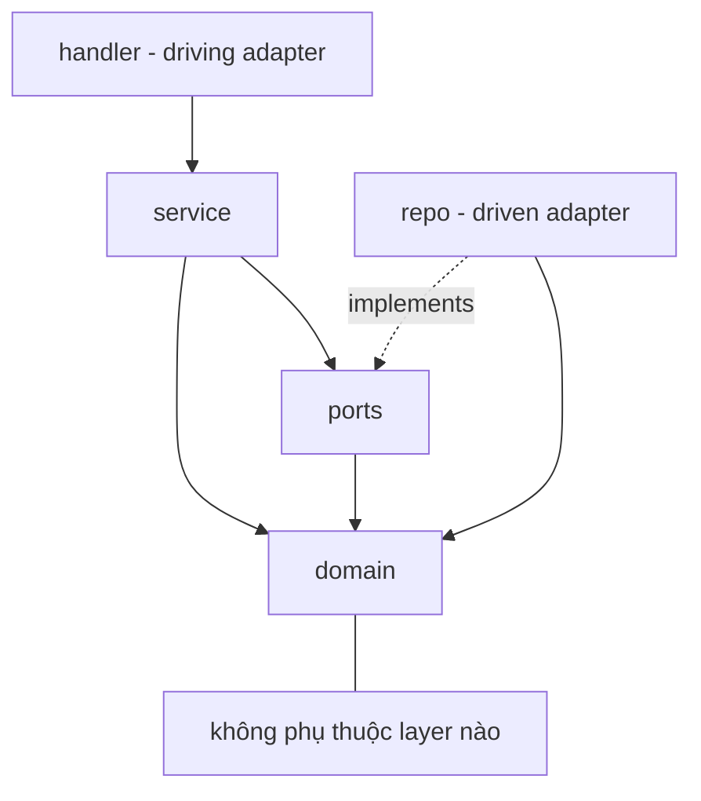
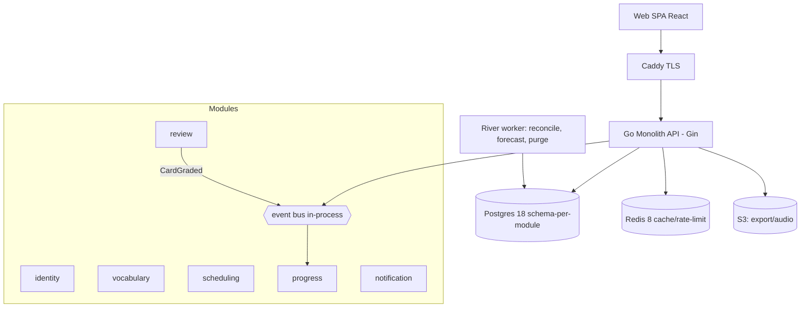
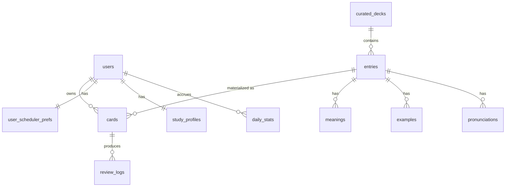

# Architecture Spine — Memorix MVP

## Design Paradigm

**Modular Monolith + Hexagonal core.** Một binary Go, deploy đơn. Chia thành **module = bounded context**; hai module lõi (Scheduling, Review) theo **hexagonal (port & adapter)** để cô lập domain FSRS khỏi framework/hạ tầng. Module giao tiếp qua interface public + event bus in-process. Ranh giới module = đường cắt service khi 1M+ (không tách sớm).

Ánh xạ layer → thư mục:
```
internal/<module>/domain    # entity, VO, logic thuần — không import ngoài
internal/<module>/service   # use case, orchestration, phát event
internal/<module>/ports     # interface (repo, scheduler, bus, module khác)
internal/<module>/handler   # adapter Gin (bind/validate → service)
internal/<module>/repo      # adapter Postgres (sqlc/pgx)
internal/platform/          # db, eventbus, config, logger, auth mw
```

## Invariants & Rules

Dependency direction (ai được phụ thuộc ai):

Chiều phụ thuộc: `domain` không phụ thuộc ai; `ports` chỉ dựa `domain`; `service` dựa `domain`+`ports`; `handler` gọi `service`; `repo` **implements** `ports` (adapter driven), không được `service` phụ thuộc `repo`.

### AD-1 — Ranh giới module qua interface + event bus  `[ADOPTED]`
- **Binds:** all modules
- **Prevents:** coupling ngầm, đổi nội bộ module này vỡ module khác, không tách service được
- **Rule:** Module chỉ gọi module khác qua **port/interface public** hoặc **domain event**. Cấm import struct/repo nội bộ của module khác.

### AD-2 — Domain độc lập framework/hạ tầng  `[ADOPTED]`
- **Binds:** scheduling, review (và mọi domain)
- **Prevents:** khóa Gin/Postgres vào lõi, không test/không đổi hạ tầng được
- **Rule:** `domain` không import Gin, pgx, hay bất kỳ lib hạ tầng. Handler Gin chỉ bind+validate rồi gọi `service`. `gin.Context`/`*http.Request` **không** truyền xuống service/domain.

### AD-3 — Grade nguyên tử + idempotent  `[ADOPTED]`
- **Binds:** review, scheduling; FR-13, FR-15, NFR-5
- **Prevents:** double-grade (double-tap / đa thiết bị), lịch sai, mất log
- **Rule:** Một lần chấm = **1 transaction**: update `cards` (S/D/Due/status) + insert `review_logs`. Idempotency qua `unique(card_id, client_review_id)`; trùng → trả kết quả cũ, không chấm lại.

### AD-4 — ReviewLog append-only = nguồn chân lý  `[ADOPTED]`
- **Binds:** review, progress, scheduling; FR-16, NFR-6
- **Prevents:** mất dữ liệu học, không đổi thuật toán/không giải xung đột sync được
- **Rule:** `review_logs` **chỉ append**, không update/delete. Trạng thái FSRS của card và mọi read model Progress **phải rebuild-được** từ chuỗi log theo `reviewed_at` (server-ts). Không có nguồn chân lý nào khác cho lịch sử học.

### AD-5 — Scheduling server-authoritative  `[ADOPTED]`
- **Binds:** review API, scheduling; FR-12, FR-14, NFR-9
- **Prevents:** client giả lịch (gian lận), lệ thuộc phiên bản thuật toán ở client
- **Rule:** Client chỉ gửi `{card_id, grade, client_review_id}`. Server tính S/D/Due. `next_intervals` cho 4 mức do server trả trong queue; client **không** tự tính FSRS.

### AD-6 — Entry (nội dung) tách Card (FSRS/user)  `[ADOPTED]`
- **Binds:** vocabulary, scheduling; FR-7, FR-8, G (domain)
- **Prevents:** nhân bản nội dung, curated không chia sẻ được N user
- **Rule:** `entries` giữ nội dung (owner_id NULL = curated toàn cục). `cards` giữ trạng thái học **per-user, per-direction**, tham chiếu `entry_id`. Card **không** nhúng nội dung entry.

### AD-7 — FSRS qua port  `[ADOPTED]`
- **Binds:** scheduling; FR-12, H
- **Prevents:** khóa một phiên bản thuật toán, không A/B được
- **Rule:** Toán FSRS chỉ gọi qua interface `Scheduler` (bọc `go-fsrs`). Không viết lại công thức trong domain. Cho phép thay/so nhiều impl trên cùng `review_logs`.

### AD-8 — Read model async, eventual; nguồn chân lý = log  `[ADOPTED]`
- **Binds:** progress, notification; Fork-1; FR-24, FR-31
- **Prevents:** ghép Progress vào hot path grade; mất event gây drift số liệu; **hai builder chọn khác nguồn cho số hiển thị tức thì**
- **Rule:** Cập nhật Progress (daily_stats/streak/North Star) **không** nằm trong TX grade. **MVP**: event `CardGraded` in-process fire-and-forget + **job reconcile định kỳ** rebuild daily_stats từ `review_logs` (dựa AD-4). **V1** (khi Notification cần đảm bảo-giao): nâng **transactional outbox**.
- **Số hiển thị tức thì** (tổng kết cuối phiên FR-24, North Star "tuần này" FR-31): đọc **trực tiếp từ `review_logs` của phiên/tuần hiện tại** (authoritative, không lag). Dashboard/heatmap lịch sử đọc `daily_stats` (eventual). Không lấy số tức thì từ `daily_stats` đang lag.

### AD-9 — Truy cập dữ liệu chéo module qua port module chủ  `[ADOPTED]`
- **Binds:** all modules; Fork-2a
- **Prevents:** rò rỉ ranh giới, đổi schema module này vỡ module khác
- **Rule:** Module không join/đọc thẳng bảng của module khác. Lấy dữ liệu chéo qua **service/port của module sở hữu** (vd Scheduling hỏi Vocabulary qua `VocabularyPort`, batch-load).

### AD-10 — FK chỉ trong cùng schema; chéo module = ref logic  `[ADOPTED]`
- **Binds:** all modules, DB; Fork-2b
- **Prevents:** ghép chặt DB chéo module, cản tách service
- **Rule:** Foreign key **chỉ** trong cùng schema module. Tham chiếu chéo module = cột id (vd `cards.entry_id`) **không** FK vật lý; toàn vẹn do app đảm bảo (check tồn tại khi tạo card). Queue read model denormalize field entry hiển thị hoặc batch-load qua port — **không join hot path**.

### AD-11 — Auth: JWT stateless + refresh rotation + OAuth linking trong Identity  `[ADOPTED]`
- **Binds:** identity, mọi API; FR-1..4, NFR-7
- **Prevents:** phiên không thu hồi được, token trộm dùng lại, ghép nhầm tài khoản OAuth
- **Rule:** Access JWT ngắn (15m) verify ở middleware platform. Refresh opaque, hash trong DB, **rotation + reuse-detection** trong Identity. `principal` (userId, role) xuống **service**, không xuống **domain**. OAuth: verify id_token (sig/aud/iss + nonce/state), link qua `oauth_identities (provider, provider_uid)`; **không** tin email chưa-verified để tự-merge tài khoản.

### AD-12 — Thời gian: server-truth cho Due, TZ user cho "ngày học"  `[ADOPTED]`
- **Binds:** scheduling, review; FR-18
- **Prevents:** đồng hồ client lệch làm sai lịch; đếm ngày sai qua DST
- **Rule:** So Due theo **server time** (UTC). "Ngày học" và đếm daily-limit theo **TZ người dùng**, có grace qua nửa đêm. Không tin timestamp client.

### AD-13 — Migration expand-and-contract  `[ADOPTED]`
- **Binds:** DB, deploy; Phase 12
- **Prevents:** downtime / vỡ khi 2 version app chạy song song lúc deploy
- **Rule:** Migration versioned (golang-migrate), theo **expand → migrate data → contract**, backward-compatible giữa hai version kề. Chạy migration trước khi deploy code mới. *(Ràng buộc thực sự cắn từ Stage 4 khi có concurrent-version/rolling deploy; MVP 1-instance vẫn theo để khỏi đổi thói quen sau.)*

### AD-14 — Hợp đồng API nhất quán  `[ADOPTED]`
- **Binds:** mọi HTTP handler; Phase 9
- **Prevents:** mỗi endpoint tự chế lỗi/phân trang khác nhau
- **Rule:** Lỗi = `{error:{code,message,fields,trace_id}}` với mã chuẩn (VALIDATION_ERROR/UNAUTHENTICATED/FORBIDDEN/NOT_FOUND/CONFLICT/RATE_LIMITED/INTERNAL). Danh sách = **cursor pagination**. Version qua path `/api/v1`.

## Consistency Conventions

| Concern | Convention |
| --- | --- |
| Module naming | bounded context: `identity`, `vocabulary`, `scheduling`, `review`, `progress`, `notification` |
| Event naming | PascalCase, thì quá khứ: `CardGraded`, `EntryCreated`, `ReviewSessionCompleted` |
| Table/column | `snake_case`; PK `id uuid`; audit `created_at/updated_at`; soft delete `deleted_at` (partial index `WHERE deleted_at IS NULL`) |
| ID | uuid v4 (`gen_random_uuid()`); idempotency key = `client_review_id` (text, client-gen) |
| Time | `timestamptz` UTC lưu trữ; "ngày học" quy đổi theo TZ user ở service |
| Error/envelope | `{error:{code,message,fields,trace_id}}`; pagination `{data, page:{next_cursor,has_more,limit}}` |
| Mutation | domain command qua service; cross-aggregate qua id + event, không khóa chung TX |
| Logging/config | slog JSON structured (scrub PII/token); 12-factor env; secrets SOPS/Vault prod |
| Auth | `Bearer` access JWT; ownership check (`owner_id == principal`) ở service, deny-by-default |

## Stack

| Name | Version |
| --- | --- |
| Go | 1.26 |
| Gin | v1.10 |
| pgx / sqlc | pgx v5 / sqlc v1 |
| golang-migrate | v4 |
| River (job queue) | v0 (Postgres-backed) |
| go-fsrs | latest (bọc qua port) |
| PostgreSQL | 18 |
| Redis | 8 |
| React + TypeScript + Vite | React 19 / Vite 7 (client, spine riêng nếu cần) |

## Structural Seed

### Container view (MVP)


### Core entities (tên + quan hệ; thuộc tính là invariant → xem AD)


### Source tree (seed)
```text
memorix/
  cmd/api/            # Gin server
  cmd/worker/         # River jobs
  internal/
    identity/         # auth, users, sessions
    vocabulary/       # entries, curated seed deck
    scheduling/       # cards, FSRS port, queue, prefs
    review/           # session, grade, review_logs
    progress/         # read model: daily_stats, streak, North Star
    notification/     # (thin ở MVP)
    platform/         # db, eventbus, config, logger, authmw
  migrations/         # golang-migrate, schema-per-module
```

> Mapping thư mục chi tiết + cách compiler enforce ranh giới (AD-1/2/9/10): xem companion **`addendum-structure.md`**.

### Deployment (MVP → sau)
MVP: Docker Compose trên 1 VPS — api + worker + Postgres + Redis + Caddy. Staging + prod. Prod thêm Prometheus/Grafana/Loki. **Backup: WAL archiving + PITR (pgBackRest), RPO<5 phút (NFR-4)** — bắt buộc từ prod. Scale: API stateless → nhiều instance sau LB (Stage 4); tách service theo bounded context (Stage 6, 1M+).

## Capability → Architecture Map

| Epic / Area | Lives in | Governed by |
| --- | --- | --- |
| E1 Auth & Account | `identity` | AD-11, AD-14 |
| E2 Vocabulary CRUD | `vocabulary` | AD-6, AD-9, AD-10 |
| E2b Starter deck seed | `vocabulary` + `scheduling` | AD-6, AD-9, FR-27 rải new |
| E3 FSRS Scheduling | `scheduling` | AD-5, AD-7, AD-12 |
| E4 Review flow | `review` (+ scheduling) | AD-3, AD-4, AD-5 |
| E5 Queue & limits + chống nổ | `scheduling` | AD-8 (read model), AD-12, FR-25/28 |
| E6 Stats & North Star | `progress` | AD-4, AD-8 |
| Cross-cutting: API/error | all handlers | AD-14 |
| Cross-cutting: events | `platform` bus | AD-1, AD-8 |

## Deferred

| Deferred | Vì sao đợi được |
| --- | --- |
| Transactional outbox cho event | MVP fire-and-forget + reconcile đủ (AD-8); cần khi Notification đảm bảo-giao lên V1 |
| OpenSearch | pg FTS đủ tới khi độ phức tạp/tải search ép |
| Sync 2 chiều / CRDT | MVP server-truth; sync V1.5 dùng replay-from-log (AD-4) |
| Tách service / shard theo bounded context | Monolith + 1 Postgres đủ tới ~100k; tách khi 1M+ (ranh giới AD-1/9/10 đã sẵn) |
| FSRS optimizer weights/user | Cần ~1000 review/user; V2 |
| RN/Expo app + PWA offline | V1.5; MVP web responsive |
| Ngưỡng chống-nổ chính xác (OQ-2), N North Star (OQ-3=7), Apple OAuth timing (OQ-4) | Tinh chỉnh bằng dữ liệu beta |
