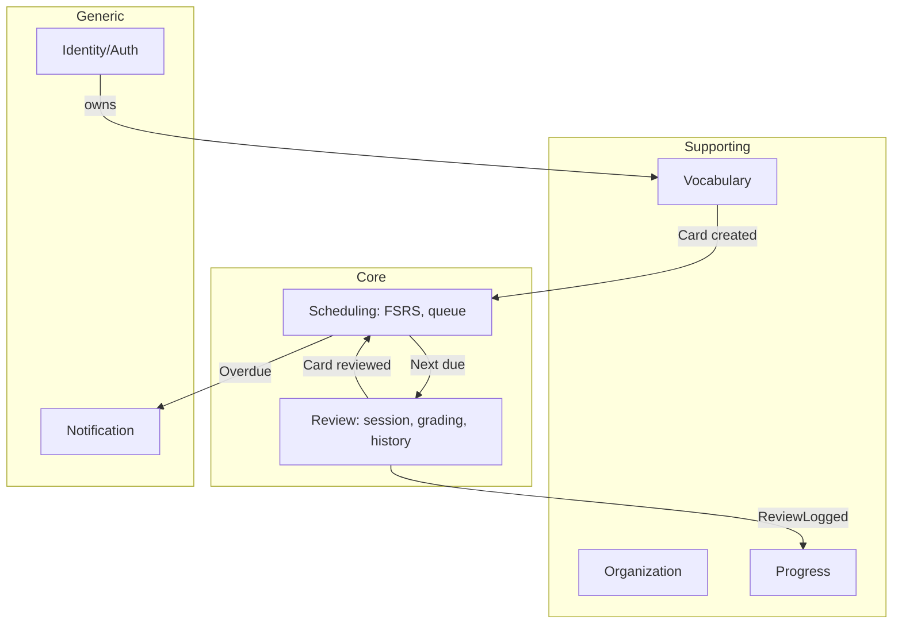

# Phase 3 — Domain Model (DDD)

> **Thách thức**: đừng biến mọi thứ thành aggregate. Chọn đúng nơi nhất quán mạnh (thẻ + lịch FSRS) vs nơi eventual OK (stats, notification).

## Core vs Supporting vs Generic
| Loại | Domain | Vì sao |
|---|---|---|
| **Core** | Scheduling (FSRS) + Learning/Review | khác biệt cạnh tranh, tự build |
| Supporting | Vocabulary/Content, Collections | cần nhưng không lợi thế |
| Supporting | Progress/Statistics | phái sinh từ review |
| Generic | Identity/Auth, Notification | dùng lib |

## Bounded Contexts

Quan hệ: Vocabulary→Scheduling (Customer/Supplier), Review↔Scheduling (Partnership), Review→Progress/Notification (event, eventual consistency).

## Ubiquitous Language
| Từ | Nghĩa |
|---|---|
| Entry | đơn vị nội dung: từ/cụm/idiom + nghĩa, ví dụ, phát âm |
| Card (Thẻ) | đơn vị **học** của 1 user cho 1 Entry (1 hướng). 1 Entry → N Card |
| Review | 1 lần user chấm 1 Card |
| Grade | Again/Hard/Good/Easy (1-4) |
| Stability (S) | số ngày để R tụt 100%→90% |
| Difficulty (D) | độ khó thẻ (1-10) |
| Retrievability (R) | xác suất nhớ lúc t |
| Due / Overdue | thời điểm nên ôn / đã qua chưa ôn |
| Lapse | chấm Again → thẻ quên, reset một phần |
| Retention đo được | % recall thật tại mốc |

## Aggregates
- **Card** (root nhỏ, giao dịch chặt): cardId, entryId(ref), ownerId, direction, FsrsState(VO: S,D,reps,lapses,status), Due(VO). Grade + FSRS cập nhật **nguyên tử**. Hot path — giữ nhỏ.
- **Entry** (aggregate riêng, nội dung): term, meanings[], examples[], pronunciations[], syn/ant, notes. Card **ref entryId**, không nhúng (curated dùng chung N user).
- **Collection**: giữ danh sách entryId (ref).
- **ReviewLog**: KHÔNG trong Card aggregate (append-only, khối lượng lớn, đọc bởi Progress). Cross-aggregate qua id ref + domain event, không khóa chung transaction.

## Value Objects
FsrsState, Due, Grade, Term, Meaning, Example, Pronunciation, SynonymSet, Tag, RetentionRate, Interval, DesiredRetention, Direction.

## Commands
CreateEntry, UpdateEntry, DeleteEntry, AddCardForEntry, SuspendCard, ResetCard, StartReviewSession, GradeCard, CreateCollection, AddEntryToCollection, TagEntry, ImportDeck, EnrollInCuratedDeck, SetDesiredRetention, SetDailyLimits, ScheduleReminder.

## Queries
GetDueQueue, GetCard, SearchEntries, GetCollection, GetTags, GetStats, GetHeatmap, GetCalendar, GetRetentionCurve, GetOverdueCount, GetStreak. → **CQRS nhẹ**: read model riêng cho queue + stats.

## Domain Events
EntryCreated, CardCreated, **CardGraded**, CardScheduled, CardLapsed, ReviewSessionCompleted, CardBecameOverdue, StreakUpdated, DeckEnrolled.

## Policies
- EntryCreated (personal) → auto AddCardForEntry.
- DeckEnrolled → bulk AddCardForEntry (tôn trọng daily new limit).
- CardGraded=Again → Lapse (giảm S, Relearning).
- CardBecameOverdue > N → chống-nổ + winback.
- ReviewSessionCompleted → cập nhật streak + retention (eventual).

## Permissions (RBAC)
| Role | Quyền |
|---|---|
| Learner | CRUD entry/card/collection/tag của mình; enroll curated; review; stats mình |
| Pro Learner | + sync, curated cao cấp, AI-fill, export |
| Curator | CRUD curated deck/entry, publish |
| Admin | quản user/sub/moderation/metric |
Nguyên tắc: ownership check mọi personal aggregate. Curated read-only với learner.

## State Machines
**Entry**: Draft→Active→Archived→Deleted (curated: +InReview→Published→Deprecated).
**Card (FSRS)**: New→Learning→Review; Review→Relearning (Again lapse)→Review; Review↔Suspended.
**Review session**: Idle→SessionActive→ShowingFront→ShowingBack→Grading→ApplyFSRS→NextCard/SessionDone.
**Collection**: Empty→Populated→Archived→Deleted.
**Notification**: Scheduled→Sent→Acknowledged/Expired; Scheduled→Cancelled (user ôn trước).
**Progress/Streak**: Cold→Active→AtRisk→Broken (lỡ ngày, streak reset nhưng **retention không reset** — trung thực).

## Cơ hội ẩn
1. Card tách Entry → curated chia sẻ, FSRS/user riêng, AI-fill 1 lần.
2. ReviewLog append-only + event-sourced Progress → tính lại metric khi đổi công thức.
3. Chống-nổ-queue là domain concept hạng nhất trong Scheduling.
4. Direction là VO của Card → đa loại thẻ không đổi aggregate.

**Chốt**: 2 core context (Scheduling+Review) gắn chặt quanh **Card aggregate** (nguyên tử, nhỏ). Entry/Collection tách, ref id. Progress/Notification downstream nghe event. Entry vs Card = phân biệt sống còn.
