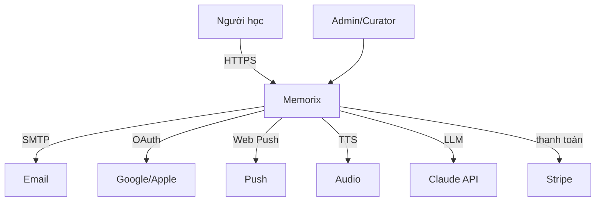
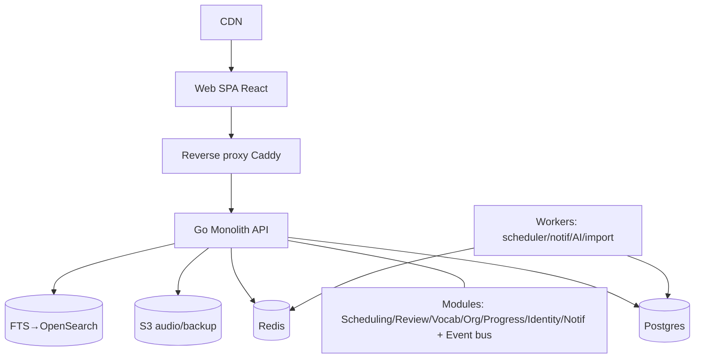
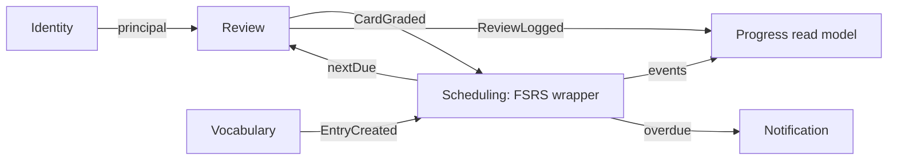
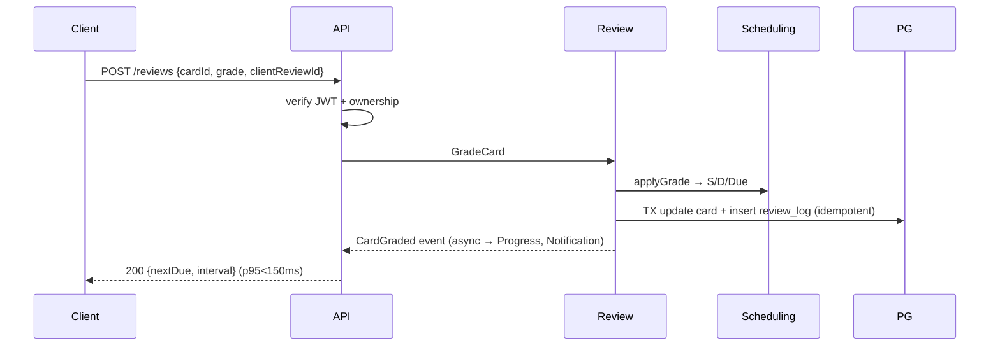
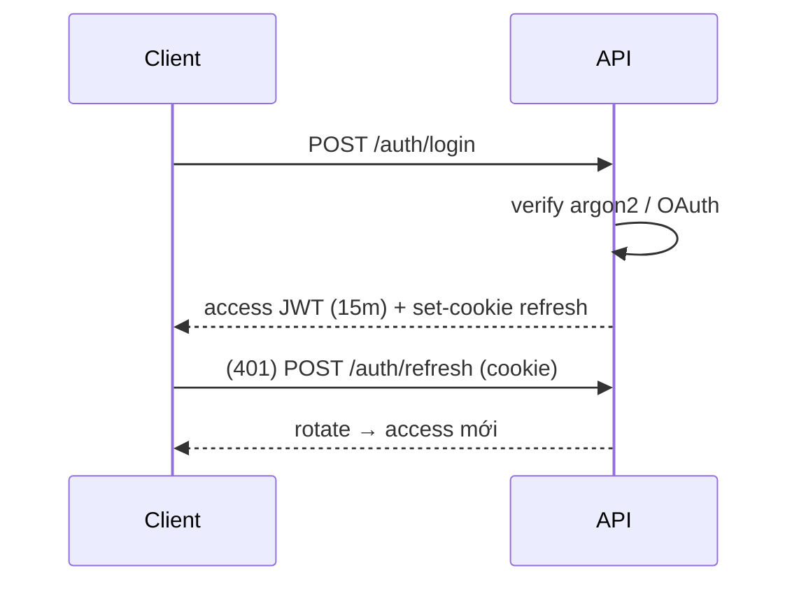

# Phase 7 — Kiến trúc Hệ thống

> **Thách thức**: đừng chọn microservices vì "nghe scale". 100k user vẫn dư sức chạy modular monolith. Microservices sớm = giao dịch phân tán + DevOps đắt + team solo chết.

## So sánh kiến trúc
| Kiểu | Hợp Memorix? |
|---|---|
| Layered | MVP nhanh nhưng thiếu ranh giới |
| Clean/Hexagonal | ✅ core Scheduling xứng đáng |
| DDD | ✅ core context, nhẹ phần khác |
| **Modular Monolith** | ✅✅ **lựa chọn** |
| Microservices | ❌ sớm |
| Event-Driven | ✅ **bên trong** monolith (bus nội bộ) |

## Khuyến nghị theo giai đoạn
- **MVP**: Modular Monolith (Go), Clean trong core (Scheduling/Review), Layered generic. 1 Postgres. Event in-process.
- **Production**: + Redis cache + read model queue/stats (CQRS nhẹ) + worker tách (scheduler/notification).
- **Large-scale (1M+)**: tách context ồn ào thành service khi **đo được** bottleneck (Review write, Notification, Stats). Giữ phần còn lại monolith.
Nguyên tắc: **module trước, service sau**. Ranh giới bounded-context = đường cắt sẵn.

## System Context

## Container

## Module Diagram

Ranh giới cứng: module gọi nhau **chỉ** qua interface public + event bus. Không import struct nội bộ module khác.

## Request Flow (chấm 1 thẻ)

## Authentication Flow
Access JWT 15m + refresh rotation (httpOnly cookie); reuse-detection thu hồi family; email verify + reset token 1 lần TTL ngắn.

## Review Scheduling Flow
Realtime: GET queue → index scan (ownerId,dueAt≤now) → priority → daily limit + chống nổ → trả. Cron worker: quét overdue → rải/winback; tính forecast cache Redis.

## Notification Flow
Scheduling → event → Notification policy (theo TZ, quiet hours) → store; worker poll due → dedupe + check user đã ôn → gửi push/email hoặc cancel.

## ADR tóm tắt
| # | Quyết định | Vì sao |
|---|---|---|
| ADR-1 | Modular Monolith, không microservices | solo/small; 100k thừa; tách sau theo context |
| ADR-2 | Clean cho Scheduling+Review | bọc lib FSRS, đổi thuật toán/DB không đụng domain |
| ADR-3 | Event bus in-process (interface sẵn) | decouple Progress/Notif, chưa cần broker |
| ADR-4 | CQRS nhẹ read model queue/stats | tách đọc nóng khỏi write |
| ADR-5 | ReviewLog append-only + replay | nguồn chân lý, giải sync, đổi thuật toán retroactive |
| ADR-6 | Postgres 1 DB schema-per-module | ranh giới dữ liệu, tách DB sau |

## Cơ hội ẩn
1. Schema-per-module → tách service chỉ bê schema ra.
2. Event bus qua interface → in-process → NATS/Kafka không đổi module.
3. FSRS wrapper là port → A/B thuật toán trên cùng log.
4. Worker tách sớm dù cùng codebase → deploy/scale riêng.

**Chốt**: Modular Monolith Go, Clean trong core, event bus nội bộ, CQRS nhẹ, 1 Postgres schema-per-module + Redis. Hot path grade nguyên tử + idempotent p95<150ms. Bounded-context = đường cắt service khi 1M+.
