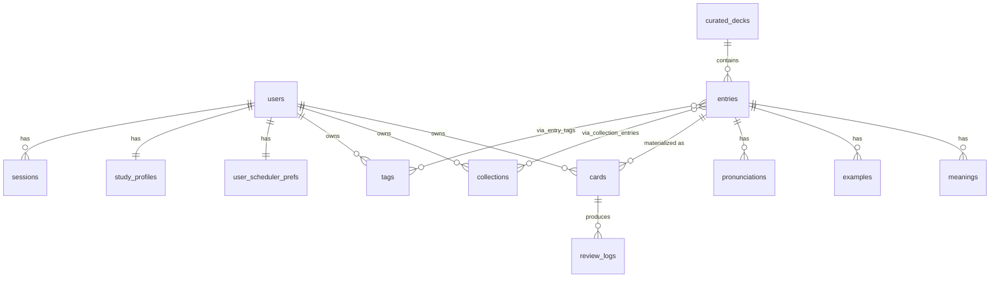

# Phase 8 — Thiết kế Database

> **Thách thức**: `entries` đọc-nhiều (curated dùng chung), `cards` ghi-nóng mỗi lần chấm → tách ra. `review_logs` append-only khối lượng lớn → partition. Postgres, schema-per-module.

> Sơ đồ trực quan HTML: xem Artifact "memorix-db-schema" (24 bảng / 8 module).

## ER Diagram

## Quy ước chung
`id uuid pk` · `created_at/updated_at timestamptz` · `deleted_at timestamptz null` (**soft delete**, partial index `WHERE deleted_at IS NULL`) · `created_by/updated_by` (audit bảng admin/curated) · thời gian `timestamptz` UTC, "ngày học" theo TZ ở app · FK có ON DELETE rõ (RESTRICT content, CASCADE con thuần).

## Identity
- **users**: id, email(citext unique), password_hash(null nếu OAuth, argon2), display_name, plan(free|pro|edu), role(learner|curator|admin), timezone, locale, theme, email_verified_at.
- **oauth_identities**: user_id, provider(google|apple), provider_uid, unique(provider,uid).
- **sessions**: user_id, refresh_token_hash(index), family_id(rotation, reuse-detect), user_agent/ip, expires_at, revoked_at.
- **email_tokens**: user_id, kind(verify|reset), token_hash(index), expires_at, used_at.
- **billing_subscriptions**: user_id, stripe_*, status, current_period_end.

## Vocabulary
- **entries**: id, owner_id(null=curated toàn cục), curated_deck_id, term, term_normalized(unaccent+lower, unique với owner), part_of_speech, notes, source(user|curated|import). Index: `unique(owner_id,term_normalized) WHERE deleted_at IS NULL`, gin FTS(term+notes), (curated_deck_id).
- **meanings / examples / pronunciations / synonyms_antonyms**: entry_id (CASCADE) + fields.
- **curated_decks**: title, goal(ielts|toefl|business|general), is_premium, status(draft|published|deprecated), created_by(curator).

## Organization
- **collections**: owner_id, name, type(personal|system).
- **collection_entries**: pk(collection_id, entry_id) M:N.
- **tags**: owner_id, name unique(owner,name).
- **entry_tags**: pk(entry_id, tag_id), index(tag_id).
- **favorites**: pk(user_id, entry_id).

## Scheduling (GHI NÓNG)
- **cards**: owner_id, entry_id, direction, **stability, difficulty, status(new|learning|review|relearning|suspended), reps, lapses, due_at, last_review_at**. Index nóng: `(owner_id, due_at) WHERE deleted_at IS NULL AND status<>suspended` (build queue), `(owner_id, status)`, `unique(owner_id, entry_id, direction)`.
- **user_scheduler_prefs**: desired_retention(CHECK 0.8-0.97, def 0.9), daily_new_limit(20), daily_review_limit(200), fsrs_weights(jsonb optimizer/user), exam_deadline.
- **deck_enrollments**: user_id, curated_deck_id, cards_created, total, status, unique(user,deck).

## Review (APPEND-ONLY)
- **review_logs** — PARTITION BY RANGE(reviewed_at) theo tháng: card_id, owner_id, grade(CHECK 1-4), retrievability, stability_before/after, difficulty_before/after, elapsed_days, scheduled_days, reviewed_at, client_review_id, duration_ms. `unique(card_id, client_review_id)` (**chống double-grade**), index(card_id,reviewed_at), (owner_id,reviewed_at). pk(id, reviewed_at).

## Progress (read model, rebuild từ review_logs)
- **study_profiles**: user_id, streak_current/best, last_study_date, total_reviews, total_retained.
- **daily_stats**: pk(user_id, day), reviews_done, new_done, **retained (North Star)**, again/hard/good/easy.
- **retention_snapshots**: user_id, window(30d|90d|180d), measured_rate, computed_at.

## Notification
- **notifications**: user_id, type(daily_reminder|winback|weekly_progress), channel(push|email), scheduled_at, status, payload, dedupe_key, `unique(user_id,dedupe_key) WHERE status IN (scheduled,sent)`, index(status, scheduled_at).
- **push_subscriptions**: user_id, endpoint, keys.
- **notification_prefs**: user_id, daily_time, quiet_start/end, channels, opted_out.

## History / Audit
- **audit_logs**: actor_id, action, entity_type/id, before/after(jsonb), ip, at. Cho hành động nhạy cảm (đổi role, xóa account, sửa curated) — không log mọi CRUD.
- **entry_revisions**: entry_id, snapshot, edited_by, edited_at.
- `review_logs` chính là history học tập.

## Index chiến lược
`cards(owner_id, due_at) partial` (nóng nhất) · `review_logs unique(card_id, client_review_id)` (idempotency) + partition tháng · `entries gin FTS` + `unique(owner_id, term_normalized)` · `daily_stats(user_id, day)` · `notifications(status, scheduled_at)`.

## Constraints then chốt
`unique(card_id, client_review_id)`, `unique(owner_id, entry_id, direction)`, `CHECK grade IN (1,2,3,4)`, `CHECK desired_retention 0.8..0.97`, FK content RESTRICT / con CASCADE, partial index `deleted_at IS NULL`.

## Cơ hội ẩn
1. entries.owner_id NULL = curated toàn cục → 1 hàng nội dung cho N user, mỗi user 1 cards row.
2. term_normalized → chống trùng + search bỏ dấu.
3. fsrs_weights jsonb/user → optimizer không đổi schema.
4. daily_stats/study_profiles rebuild-từ-log.
5. review_logs partition → drop cũ O(1), vacuum nhẹ.

**Chốt**: tách `entries` (đọc nhiều, curated chung) khỏi `cards` (ghi nóng, FSRS/user). `review_logs` append-only partition tháng + idempotency. Progress = read model rebuild-được. Soft delete + audit chọn lọc + index nóng `(owner_id, due_at)`.
