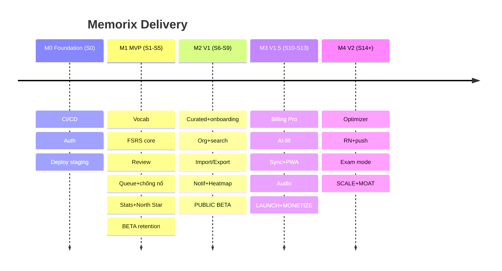

# Phase 14 — Kế hoạch Bàn giao

> 14 phase spec đồ sộ → dễ ôm hết vào MVP rồi chết. MVP thật = thứ nhỏ nhất chứng minh cược lớn nhất (người nghiêm túc trả tiền cho UX tốt hơn Anki?). Cắt tàn nhẫn.

## Epics
| # | Epic | Ưu tiên |
|---|---|---|
| E1 | Auth & Account | MVP |
| E2 | Vocabulary CRUD | MVP |
| E3 | FSRS Scheduling core | MVP |
| E4 | Review flow | MVP |
| E5 | Queue & daily limits + chống nổ | MVP |
| E6 | Basic stats + North Star | MVP |
| E7 | Organization (collection/tag/favorite/search) | V1 |
| E8 | Curated decks + enroll | V1 |
| E9 | Import/Export/Backup | V1 |
| E10 | Notifications & reminders | V1 |
| E11 | Heatmap/Calendar/Forecast | V1 |
| E12 | Multi-device sync | V1.5 |
| E13 | AI card-fill | V1.5 |
| E14 | Audio pronunciation | V1.5 |
| E15 | Pro subscription + billing | V1.5 |
| E16 | PWA offline | V1.5 |
| E17 | FSRS optimizer/user | V2 |
| E18 | RN mobile app | V2 |
| E19 | Exam deadline mode | V2 |
| E20 | Reading capture / B2B / social | V2+ |

## Dependency — đường găng
E1→E2→E3→E4→E5 = xương sống MVP (tuần tự). E6 nhánh từ E4. E7-E9 từ E2. E10 từ E5. E12/E16, E13 từ E4/E2. E17/E19 từ E3. E18 từ E12.

## Milestones
| M | Nội dung | Done |
|---|---|---|
| M0 Foundation | repo, CI, DB, auth, deploy staging | pipeline xanh, deploy được |
| M1 MVP (E1-E6) | thêm từ → ôn FSRS → stats | 1 user học thật, retention đo được |
| M2 V1 (E7-E11) | curated, org, import, notif, heatmap | onboarding curated, giữ chân |
| M3 V1.5 (E12-E16) | sync, AI-fill, audio, Pro, PWA | thu tiền + mobile PWA |
| M4 V2 (E17-E19) | optimizer, RN app, exam mode | moat + store + WTP cao |

## Sprint Planning (2 tuần/sprint)
| Sprint | Focus | Deliverable |
|---|---|---|
| S0 | Foundation | Docker/CI/CD, PG+migrate, Gin skeleton, auth (register/login/JWT/refresh), staging |
| S1 | E2 Vocab | Entry CRUD API+UI, term normalize, validation, auto-card |
| S2 | E3 FSRS | go-fsrs bọc port, cards table, grade nguyên tử, ReviewLog idempotent, **test replay** |
| S3 | E4 Review | queue API, review UI (front/back/grade, phím 1-4), optimistic, next_intervals |
| S4 | E5 Queue | priority calc, daily limits, **chống nổ**, new card strategy, learn |
| S5 | E6 Stats | daily_stats read model, North Star, streak, summary API, empty states |
| → M1 | beta kín | seed user thật, đo retention 30d |
| S6 | E8 Curated | curated_decks, enroll (rải new), browse, onboarding mục tiêu |
| S7 | E7 Org | collection/tag/favorite, search (FTS), filter/sort, virtual list |
| S8 | E9 Import/Export | Anki .apkg + CSV (job), export JSON/CSV, GDPR |
| S9 | E10+E11 | reminder engine, web push, quiet hours, heatmap/calendar/forecast |
| → M2 | public beta | curated + habit loop |
| S10 | E15 Billing | Stripe, Pro gating, plan limits |
| S11 | E13 AI-fill | Claude API, suggestion UI, quota, sanitize |
| S12 | E12+E16 | sync pull/push idempotent, replay-resolve, service worker offline |
| S13 | E14 Audio | TTS/curated audio, storage+CDN |
| → M3 | launch+monetize | thu tiền, PWA mobile |
| S14+ | E17-E19 | optimizer job, RN/Expo app, exam mode |
| → M4 | scale | moat + store |

## Priorities (MoSCoW MVP)
Must: E1-E6. Should: E7-E11 (V1). Could: E12-E16 (V1.5). Won't giờ: E17-E20 (V2+).

## Risks
| Risk | Giảm |
|---|---|
| Ôm hết spec vào MVP | cắt E1-E6, feature flag |
| FSRS impl sai | lib + test replay + so Anki |
| Cold-start nội dung | seed curated trước M2, AI-fill sớm |
| Cược WTP sai | validate beta M1 trước khi build billing |
| Solo bandwidth | ưu tiên đường găng |
| Sync phức tạp | MVP server-truth, sync V1.5 replay-from-log |

## Technical Debt (có chủ đích + ADR)
Search pg FTS (→OpenSearch khi tải ép) · Job River/Postgres (→Redis khi lớn) · Monolith 1 PG (tách 1M+) · Chưa offline (V1.5) · Chưa optimizer (V2, cần log) · Desktop layout prototype chưa tách.

## Future Improvements (V2+)
Reading capture · deck chia sẻ/social/marketplace · B2B/Edu dashboard · retention outcome benchmarking · MFA · đa ngôn ngữ học · adaptive notification.

## Roadmap

Ước thô solo: M1 ~10-12 tuần · M2 ~8 · M3 ~8 · M4 liên tục. Team 2-3 → rút ~40%.

## Cơ hội ẩn
1. Beta đo retention ở M1 **trước** billing (M3) → validate cược WTP sớm.
2. Seed curated + AI-fill sớm → giết cold-start + 2 wedge khác biệt.
3. Đường găng E1→E5 rõ → lịch thực tế.
4. Nợ kỹ thuật có điều-kiện-trả → scale/hoãn có kỷ luật.

**Chốt**: MVP = E1-E6 (đường găng), beta đo retention validate WTP. V1 curated+org+import+notif. V1.5 billing+AI-fill+sync+PWA. V2 optimizer+RN+exam. Cắt tàn nhẫn, nợ có chủ đích, seed nội dung sớm.
